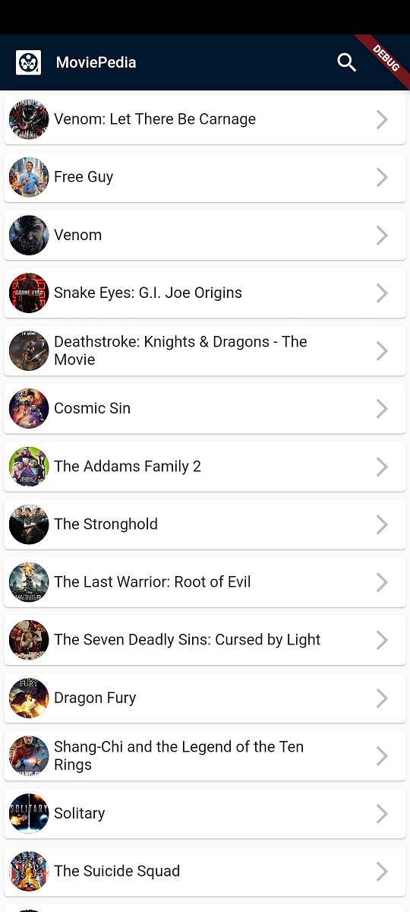

# Moviepedia
Another Flutter UI challenge project.


Steps to run the app:

* replace your obtained API key from [TheMovieDb](https://www.themoviedb.org/) in lib/common/configs/env_configs.dart like this:

  ```dart
  static const String apiKey ='[MOVIE_API_KEY]';
  =>
  static const String apiKey ='1fa9c022p0ed3x8t9bcxan7edwdq39d2';
  ```

* Generate code with this command in terminal window:

  flutter pub run build_runner build

enjoy using code freely


Dependencies:

```yaml
flutter_bloc: ^7.3.0
equatable: ^2.0.3
retrofit: ^2.0.1
json_annotation: ^4.1.0
logger: ^1.1.0
dio: ^4.0.0
fluent_assertions: ^0.4.0
get_it: ^7.2.0
sliver_tools: ^0.2.5
debounce_throttle: ^2.0.0
```


Screenshots:





## Getting Started

This project is a starting point for a Flutter application.

A few resources to get you started if this is your first Flutter project:

- [Lab: Write your first Flutter app](https://flutter.dev/docs/get-started/codelab)
- [Cookbook: Useful Flutter samples](https://flutter.dev/docs/cookbook)

For help getting started with Flutter, view our
[online documentation](https://flutter.dev/docs), which offers tutorials,
samples, guidance on mobile development, and a full API reference.
